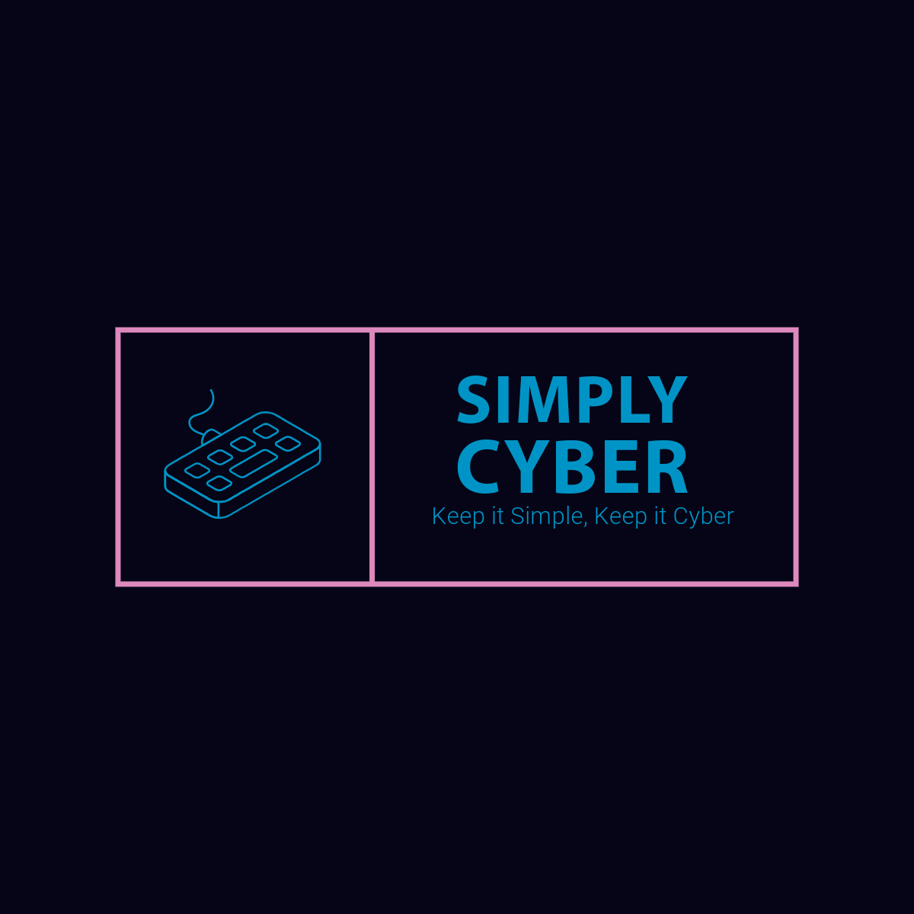
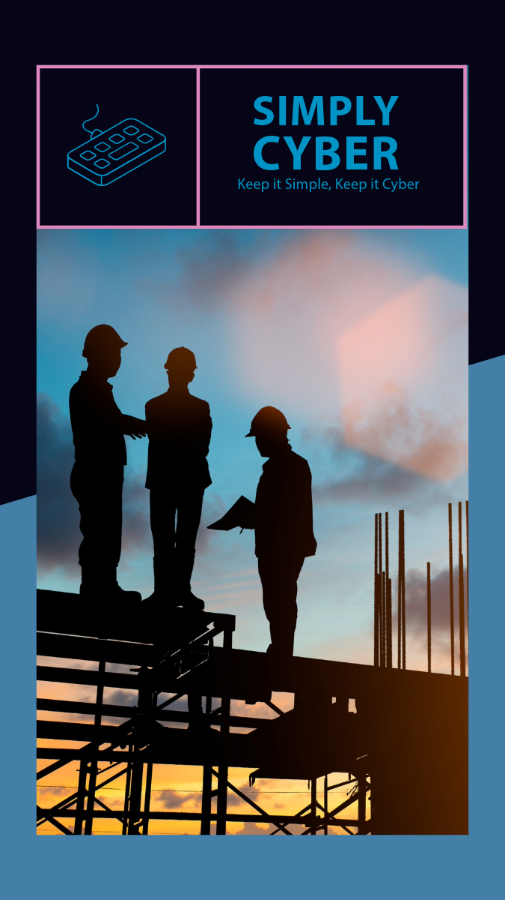

# [Simply Cyber](https://simply-cyber.webflow.io/)

<!-- toc -->

- [Graphic Design and Brand Case Study](#graphic-design-and-brand-case-study)
- [Keep it Simply, Keep it Cyber](#keep-it-simply-keep-it-cyber)
  - [References](#references)
  - [Market research](#market-research)
    - [Getac](#getac)
      - [Brand](#brand)
      - [Design](#design)
  - [Problem to Solve](#problem-to-solve)
  - [Brand Statement](#brand-statement)
  - [Creative Brief](#creative-brief)
    - [Project Title: "Rugged Evolution: Redefining Portable Computing"](#project-title-rugged-evolution-redefining-portable-computing)
      - [Client: Simply Cyber](#client-simply-cyber)
      - [Objective:](#objective)
      - [Target Audience:](#target-audience)
    - [Key Message:](#key-message)
  - [Mood Board](#mood-board)
  - [Final Design](#final-design)
    - [Color Pallete](#color-pallete)
    - [Logo Design](#logo-design)
    - [Designs](#designs)

<!-- tocstop -->

## Graphic Design and Brand Case Study

## Keep it Simple, Keep it Cyber

Simply Cyber is a technology company that produces rugged laptops at scale as well as producing high-quality custom Rugged Laptops. Rugged Laptops are a highly customizable and portable computer system. These systems are packaged in a sleek, durable exterior that is subtle as much as it is stylish. These PCs allow the user to tackle tough tasks such as data analysis or report generation in an outoor environment or visualizing complex environments on a construction site.

Simply Cyber delivers top of the line rugged Laptops that integrate with standard electrical systems and software anywhere you need it.

### References

Inspo 1: [Kaos Engineering](https://workshopbuilt.com/portfolio/kaos-engineering/)

### Market research

#### [Getac](https://www.getac.com/us/#)

##### [Brand](https://www.getac.com/us/about-us/)

_Who We Are_

"Getac Technology Corporation is a global leader in rugged mobile technology and intelligent video solutions, including laptops, tablets, software, body-worn cameras, in-car video, interview rooms, and evidence management software. Getac’s solutions and services enable the vital work done by frontline workers operating in the world’s most challenging environments."

_Vision_

"Our vision is to create and deliver extraordinary customer value and experience."

_Mission_

"To provide superior solution and services helping customers increase productivity and efficiency, reduce downtime and optimize total cost of ownership."

_Values_

- Customer Insights

"We are eager to listen, and value your insights. With an understanding of your obstacles, opportunities, and successes..."

- Innovation

"Our team strives to provide you with the best possible, comprehensive solution..."

- Trust

"We are dedicated to your goals and have best your interests in mind."

- https://www.getac.com/us/about-us/

> Getac positions itself within the niche mark of outdoor technology as a leader and is producing products that the industries seeks the most. The company prides itself in providing reliable and dependable solutions that will assist their customers in achieving their goals effectively.
> Not only is the tech popular it is a necessity to keep customers safe while they work.

##### [Design](https://tw.getacgroup.com/upload/document_contact_reprot_list_files/00af7ce9b179a9dea8f7ff2286b87724.pdf)

_Wordmak (logotype)_

  Sleek, strong, and compact. The Getac logomark captures the essence of the business by emanating ruggedness, modernity, and efficiency.

_Typeface_

[Frutiger](https://issuu.com/birkhauser.ch/docs/pdf24_zusammengef_gt__47_)

  "Frutiger is a humanist sans-serif typeface, intended to be clear and highly legible at a distance or at small text sizes. A popular design worldwide, type designer Steve Matteson described its structure as "the best choice for legibility in pretty much any situation" at small text sizes, while Erik Spiekermann named it as "the best general typeface ever." -

[Wikipedia](<https://en.wikipedia.org/wiki/Frutiger_(typeface)#cite_note-43>)

_Color_

Getac Orange - Panton 173C and Getac Gray - Pantone Cool Gray 10C is the primary color pallete of Getac. 

This palette boasts the bright and energetic orange which which serves multiple purposes. It is synonymous with a sense of awareness and visibility, similar to the effect of signs, technology, and apparel on a job site

The cool and even keeled gray presents a sense of familiarity and steadindess. This color would often be part of the standard workplace environment due to gray being a common color of metals.

### Problem to Solve

Simply Cyber aims to address the challenge of providing high-quality, customizable, and portable computing solutions for individuals and businesses in various environments. The problem they seek to solve revolves around the limitations of traditional computing systems in terms of mobility, customization, and durability. By offering rugged laptops that are specifically designed to meet these needs, Simply Cyber aims to capture a market niche and generate profit by providing innovative solutions that enhance productivity and convenience for their customers.

### Brand Statement

 Mission: Simply Cyber's mission is to simplify and enhance the technological experience for individuals and businesses by providing highly customizable and portable laptops that empower users to tackle complex tasks anywhere, anytime.

Vision: Simply Cyber envisions a world where technology seamlessly integrates into various environments, empowering users to accomplish tasks efficiently and effectively, regardless of location or conditions.

Values:

1. Innovation: Simply Cyber is committed to innovation, constantly striving to develop cutting-edge solutions that meet the evolving needs of its customers.
2. Quality: Simply Cyber prioritizes quality in every aspect of its products, ensuring that its rugged latops are of the highest standard in terms of performance, durability, and design.
3. Accessibility: Simply Cyber believes in making technology accessible to all, providing solutions that are user-friendly and adaptable to diverse settings.
4. Sustainability: Simply Cyber is dedicated to sustainability, designing products that are energy-efficient and environmentally conscious, while also promoting responsible manufacturing practices.
5. Customer Satisfaction: Simply Cyber is driven by a commitment to customer satisfaction, striving to exceed expectations by delivering exceptional products and services tailored to the needs of its clients.

### Creative Brief

#### Project Title: "Rugged Evolution: Redefining Portable Computing"

##### Client: Simply Cyber

##### Objective:

Simply Cyber seeks to innovate and evolve its Rugged^TM product line to meet the evolving needs of its target market. The objective of this project is to develop a new generation of rugged laptops that offer enhanced features, improved performance, and greater versatility, while maintaining the company's commitment to simplicity and style.

##### Target Audience:

The target audience includes tech enthusiasts, professionals working in outdoor or rugged environments (such as construction sites or field research), gamers seeking portable gaming solutions, and businesses in need of customizable computing solutions for on-the-go productivity.

#### Key Message:

Simply Cyber's new Rugged^TM lineup combines cutting-edge technology with sleek design, offering unparalleled performance and versatility for users who demand more from their portable computing devices.

### Mood Board

[Design Inspiration](https://www.figma.com/file/VsXgdF24QKZvNHuWFSazQY/Simple-Cyber-Mood-Board?type=whiteboard&node-id=201-974&t=yZotJa6nufXP3TS0-4)

[Color Inspiration](https://www.figma.com/file/VsXgdF24QKZvNHuWFSazQY/Simple-Cyber-Mood-Board?type=whiteboard&node-id=201-979&t=yZotJa6nufXP3TS0-4)

[Photography Inspiration](https://www.figma.com/file/VsXgdF24QKZvNHuWFSazQY/Simple-Cyber-Mood-Board?type=whiteboard&node-id=201-981&t=yZotJa6nufXP3TS0-4)

[Typography Inspiration](https://www.figma.com/file/VsXgdF24QKZvNHuWFSazQY/Simple-Cyber-Mood-Board?type=whiteboard&node-id=201-983&t=yZotJa6nufXP3TS0-4)

### Final Design

#### Color Pallete

- Primary Color: Cyber Dark - #050517
- Secondary Color: Cyber Light - #0094c6
- Accent Color: Cyber Accent - #de89be

#### Logo Design

- Create a modern and sleek logo that reflects Simply Cyber's commitment to simplicity, innovation, and style. It should incorporate elements that symbolize technology, portability, and versatility.

#### Designs

