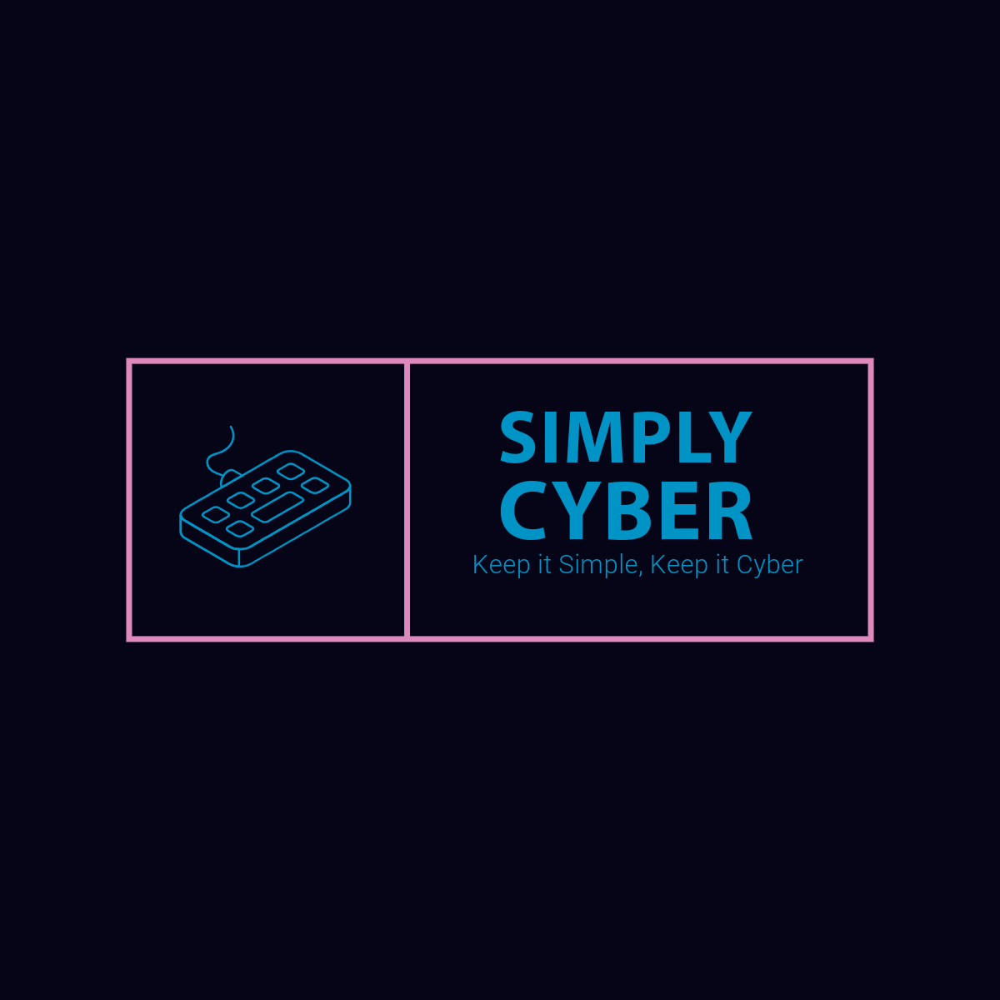

# Simply Cyber

[Simply Cyber](https://simply-cyber.webflow.io/) is a technology company specializing in rugged laptops and portable computing solutions. This README.md provides an overview of their graphic design and brand case study, along with a UX case study titled "Simply Cyber's Rugged Evolution."

## Table of Contents

- [Graphic Design and Brand Case Study](#graphic-design-and-brand-case-study)
- [Keep it Simply, Keep it Cyber](#keep-it-simply-keep-it-cyber)
  - [References](#references)
  - [Market Research](#market-research)
    - [Getac](#getac)
      - [Brand](#brand)
      - [Design](#design)
  - [Problem to Solve](#problem-to-solve)
  - [Brand Statement](#brand-statement)
  - [Creative Brief](#creative-brief)
    - [Project Title: "Rugged Evolution: Redefining Portable Computing"](#project-title-rugged-evolution-redefining-portable-computing)
      - [Client: Simply Cyber](#client-simply-cyber)
      - [Objective](#objective)
      - [Target Audience](#target-audience)
    - [Key Message](#key-message)
  - [Mood Board](#mood-board)
  - [Final Design](#final-design)
    - [Color Pallete](#color-pallete)
    - [Logo Design](#logo-design)
    - [Designs](#designs)
- [UX Case Study](#ux-case-study)
  - [References](#references-1)
  - [Simply Cyber's Rugged Evolution](#simple-cybers-rugged-evolution)
  - [Introduction/Overview](#introductionoverview)
    - [What is the user problem?](#what-is-the-user-problem)
    - [What tools and methods did you use?](#what-tools-and-methods-did-you-use)
    - [User Problem](#user-problem)
    - [User Flow](#user-flow)
    - [Wireframe](#wireframe)

## Graphic Design and Brand Case Study

### Keep it Simply, Keep it Cyber

Simply Cyber is a technology company that produces rugged laptops at scale as well as producing high-quality custom Rugged Laptops. Rugged Laptops are a highly customizable and portable computer system. These systems are packaged in a sleek, durable exterior that is subtle as much as it is stylish. These PCs allow the user to tackle tough tasks such as data analysis or report generation in an outdoor environment or visualizing complex environments on a construction site.

Simply Cyber delivers top-of-the-line rugged Laptops that integrate with standard electrical systems and software anywhere you need it.

#### References

- Inspo 1: [Kaos Engineering](https://workshopbuilt.com/portfolio/kaos-engineering)

#### Market Research

##### Getac

###### Brand

_"Getac Technology Corporation is a global leader in rugged mobile technology and intelligent video solutions, including laptops, tablets, software, body-worn cameras, in-car video, interview rooms, and evidence management software. Getac’s solutions and services enable the vital work done by frontline workers operating in the world’s most challenging environments."_

###### Design

_"Sleek, strong, and compact. The Getac logomark captures the essence of the business by emanating ruggedness, modernity, and efficiency."_

#### Problem to Solve

Simply Cyber aims to address the challenge of providing high-quality, customizable, and portable computing solutions for individuals and businesses in various environments. The problem they seek to solve revolves around the limitations of traditional computing systems in terms of mobility, customization, and durability.

### Brand Statement

- **Mission:** Simply Cyber's mission is to simplify and enhance the technological experience for individuals and businesses by providing highly customizable and portable laptops that empower users to tackle complex tasks anywhere, anytime.
- **Vision:** Simply Cyber envisions a world where technology seamlessly integrates into various environments, empowering users to accomplish tasks efficiently and effectively, regardless of location or conditions.
- **Values:**
  1. Innovation
  2. Quality
  3. Accessibility
  4. Sustainability
  5. Customer Satisfaction

#### Creative Brief

##### Project Title: "Rugged Evolution: Redefining Portable Computing"

###### Client: Simply Cyber

###### Objective:

Simply Cyber seeks to innovate and evolve its RuggedTM product line to meet the evolving needs of its target market. The objective of this project is to develop a new generation of rugged laptops that offer enhanced features, improved performance, and greater versatility, while maintaining the company's commitment to simplicity and style.

###### Target Audience:

The target audience includes tech enthusiasts, professionals working in outdoor or rugged environments (such as construction sites or field research), gamers seeking portable gaming solutions, and businesses in need of customizable computing solutions for on-the-go productivity.

##### Key Message:

Simply Cyber's new RuggedTM lineup combines cutting-edge technology with sleek design, offering unparalleled performance and versatility for users who demand more from their portable computing devices.

#### Mood Board

- [Design Inspiration](https://www.figma.com/file/VsXgdF24QKZvNHuWFSazQY/Simple-Cyber-Mood-Board?type=whiteboard&node-id=201-974&t=yZotJa6nufXP3TS0-4)
- [Color Inspiration](https://www.figma.com/file/VsXgdF24QKZvNHuWFSazQY/Simple-Cyber-Mood-Board?type=whiteboard&node-id=201-979&t=yZotJa6nufXP3TS0-4)
- [Photography Inspiration](https://www.figma.com/file/VsXgdF24QKZvNHuWFSazQY/Simple-Cyber-Mood-Board?type=whiteboard&node-id=201-981&t=yZotJa6nufXP3TS0-4)
- [Typography Inspiration](https://www.figma.com/file/VsXgdF24QKZvNHuWFSazQY/Simple-Cyber-Mood-Board?type=whiteboard&node-id=201-983&t=yZotJa6nufXP3TS0-4)

#### Final Design

##### Color Pallete

- Primary Color: Cyber Dark - #050517
- Secondary Color: Cyber Light - #0094c6
- Accent Color: Cyber Accent - #de89be

##### Logo Design

##### Designs

## UX Case Study

### Simply Cyber's Rugged Evolution

#### Introduction/Overview

As the creator of Simply Cyber, I spearheaded the project "Rugged Evolution: Redefining Portable Computing." I covered the whole process which it encompassed leading the design process from ideation to implementation

.

##### What is the user problem?

Simply Cyber aims to address the challenge of providing tech enthusiasts, professionals working in rugged environments, gamers, and businesses with a versatile and high-performance portable computing solution. The existing options in the market lack the perfect balance between performance, durability, and portability, leaving users compromising on one or more aspects of their computing needs. Users require a RuggedTM solution that seamlessly integrates into their workflows, offering robust performance, rugged durability, and effortless portability without sacrificing on functionality or design aesthetics. Therefore, the defined problem is to design and develop a Cyberdeck lineup that meets the diverse needs of users across different industries while delivering exceptional performance, durability, and portability in a sleek and stylish package.

##### What tools and methods did you use?

- [NNGroup](https://www.nngroup.com/)
- [Secondary Research](https://www.nngroup.com/articles/secondary-research-in-ux/)
- Figma

##### User Problem

##### User Flow

##### Wireframe

