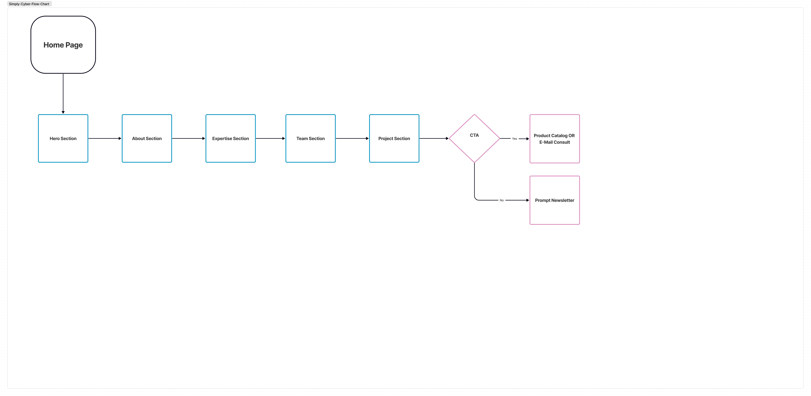
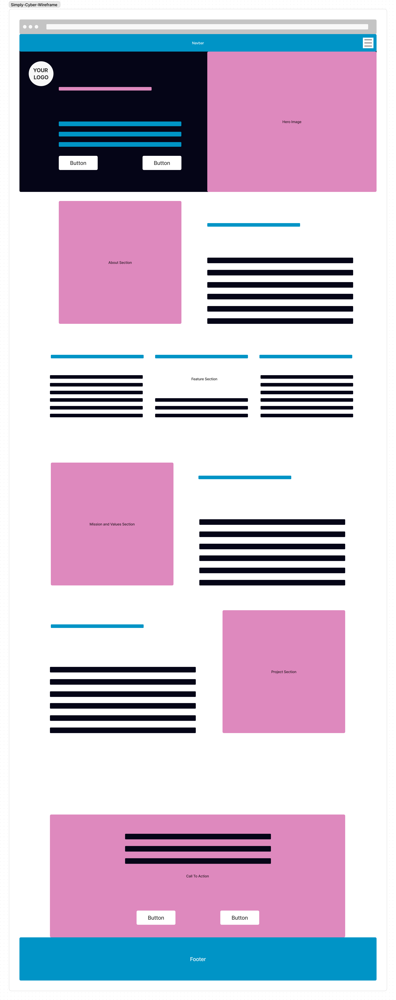

# [Simply Cyber](https://simply-cyber.webflow.io/)

## UX Case Study

## References

[Reference 2](https://zerogravitymarketing.com/our-work/marlin-digital-marketing-strategy/)

## Simply Cyber's Rugged Evolution

## Introduction/Overview

As the creator of Simply Cyber, I spearheaded the project "Rugged Evolution: Redefining Portable Computing." I covered the whole process which it encompassed leading the design process from ideation to implementation.

### **What is the user problem?** 

Simply Cyber aims to address the challenge of providing tech enthusiasts, professionals working in rugged environments, gamers, and businesses with a versatile and high-performance portable computing solution. The existing options in the market lack the perfect balance between performance, durability, and portability, leaving users compromising on one or more aspects of their computing needs. Users require a Rugged^TM solution that seamlessly integrates into their workflows, offering robust performance, rugged durability, and effortless portability without sacrificing on functionality or design aesthetics. Therefore, the defined problem is to design and develop a Cyberdeck lineup that meets the diverse needs of users across different industries while delivering exceptional performance, durability, and portability in a sleek and stylish package.

### **What tools and methods did you use?**

- [NNGroup](https://www.nngroup.com/)
- [Secondary Research](https://www.nngroup.com/articles/secondary-research-in-ux/)
- Figma

### User Problem

### User Flow

### Wireframe

